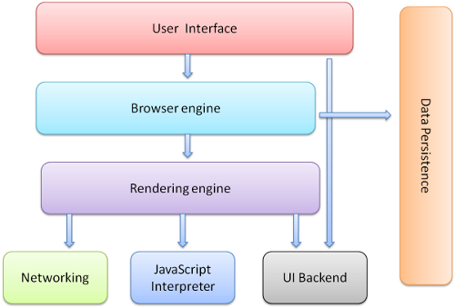

# How A Browser Works

# What happens when I type any URL in the browser ?

When you type any URL in the web browser, in order to load the page, it first have to find the IP address of the web server. It asks the Operating System (OS) to check the server name in local cache. If it is there in cache, then Rendering Engine renders the web page.

Check browser cache: In order to load the page, browser first have to find the IP address of the web server. Browsers maintain cache of DNS records for some fixed duration. So, this is the first place to resolve DNS queries. It checks local cache, if requested object is in cache and is fresh, skip to step 9

Check OS cache: If browser doesn’t contain the record in its cache, it makes a system call to underlying Operating System to fetch the server’s IP address as OS also maintains a cache of recent DNS queries.

Router Cache: If above steps fail to get a DNS record, the search continues to your router which has its own cache.

ISP cache: If everything fails, the search moves on to your ISP. First, it tries in its cache, if not found — ISP’s DNS recursive search comes into picture. DNS lookup is again a complex process which finds the appropriate ip address from a list of many options available for websites like Google.

After finding the IP address, the browser initiates a TCP connection with the server (this step is much more complex with HTTPS).

Browser sends a HTTP GET request to the server according to the specification of HTTP(Hyper Text Transfer Protocol) protocol through TCP connection.

Browser receives HTTP response and may close the TCP connection, or reuse it for another request

After getting the requested file, the browser has two things to do: interpret and render the HTML page, and obtain the remaining objects (images, flash files, javascript files, css files, audio, video, etc.) and interpret and display them.

Some browsers will begin to interpret and render the HTML file immediately and request the objects in parallel, filling in the objects as they are received. Others will wait to received all objects and, just then, will render and display the HTML file.

Rendering of html content is also done in phases. The browser first renders the bare bone html structure, and then it sends multiple GET requests to fetch other hyper linked stuff e.g. If the html response contains an image in the form of img tags such as , browser will send a HTTP GET request to the server to fetch the image following the complete set of steps which we have seen till now. But this isn’t that bad as it looks. Static files like images, javascript, css files are all cached by the browser so that in future it doesn’t have to fetch them again.
That’s it. The browser will then rest waiting the user to request another file to begin everything again.

What is the main functionality of the browser?

# High Level Components of a browser

Below you can see the main components of a browser. Browsers usually repeat the following steps for each tab. We will explain them one by one.

### The User Interface: 
The user interface is the space where User interacts with the browser. It includes the address bar, back and next buttons, home button, refresh and stop, bookmark option, etc. Every other part, except the window where requested web page is displayed, comes under it.

### The Browser Engine: 
The browser engine works as a bridge between the User interface and the rendering engine. According to the inputs from various user interfaces, it queries and manipulates the rendering engine.

### The Rendering Engine: 
The rendering engine, as the name suggests is responsible for rendering the requested web page on the browser screen. The rendering engine interprets the HTML, XML documents and images that are formatted using CSS and generates the layout that is displayed in the User Interface. However, using plugins or extensions, it can display other types data also. Different browsers user different rendering engines:
* Internet Explorer: Trident
* Firefox & other Mozilla browsers: Gecko
* Chrome & Opera 15+: Blink
* Chrome (iPhone) & Safari: Webkit

### Networking: 
Component of the browser which retrieves the URLs using the common internet protocols of HTTP or FTP. The networking component handles all aspects of Internet communication and security. The network component may implement a cache of retrieved documents in order to reduce network traffic.

### JavaScript Interpreter: 
It is the component of the browser which interprets and executes the javascript code embedded in a website. The interpreted results are sent to the rendering engine for display. If the script is external then first the resource is fetched from the network. Parser keeps on hold until the script is executed.

### UI Backend: 
UI backend is used for drawing basic widgets like combo boxes and windows. This backend exposes a generic interface that is not platform specific. It underneath uses operating system user interface methods.

### Data Persistence/Storage: 
This is a persistence layer. Browsers support storage mechanisms such as localStorage, IndexedDB, WebSQL and FileSystem. It is a small database created on the local drive of the computer where the browser is installed. It manages user data such as cache, cookies, bookmarks and preferences.

# Rendering engine and its use

Rendering engine
The networking layer will start sending the contents of the requested documents to the rendering engine in chunks of 8KBs.

Rendering engine basic flow
The rendering engine parses the chunks of HTML document and convert the elements to DOM nodes in a tree called the “content tree” or the “DOM tree”. It also parses both the external CSS files as well in style elements.

While the DOM tree is being constructed, the browser constructs another tree, the render tree. This tree is of visual elements in the order in which they will be displayed. It is the visual representation of the document. The purpose of this tree is to enable painting the contents in their correct order. Firefox calls the elements in the render tree “frames”. WebKit uses the term renderer or render object.

After the construction of the render tree, it goes through a “layout process” of the render tree. When the renderer is created and added to the tree, it does not have a position and size. The process of calculating these values is called layout or reflow. This means giving each node the exact coordinates where it should appear on the screen. The position of the root renderer is 0,0 and its dimensions are the viewport–the visible part of the browser window. All renderers have a “layout” or “reflow” method, each renderer invokes the layout method of its children that need layout.

The next stage is painting. In the painting stage, the render tree is traversed and the renderer’s “paint()” method is called to display content on the screen. Painting uses the UI backend layer.

The rendering engine always tries to display the contents on the screen as soon as possible for better user experience. It does not wait for the HTML parsing to complete before starting to build and layout the render tree. It parses and displays the content it has received from the network, while rest of the contents stills keeps coming from the network.

